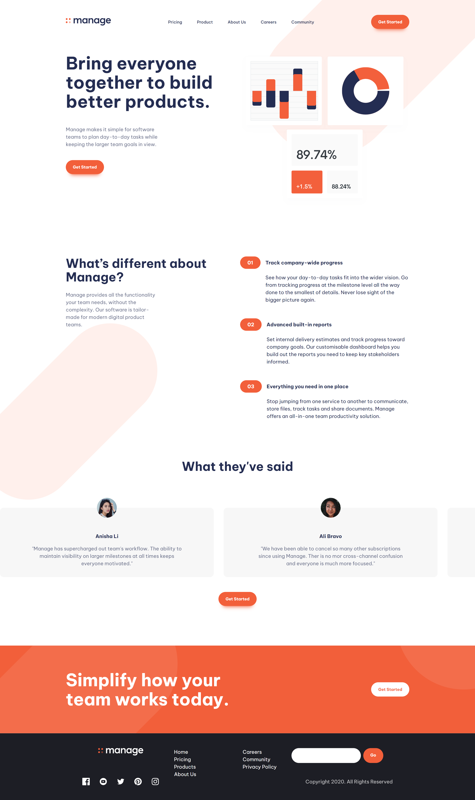
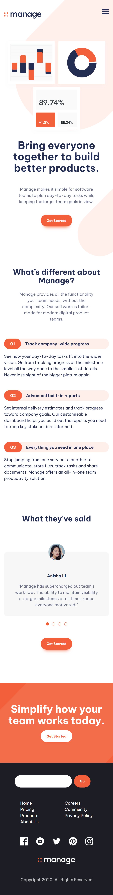

# Frontend-Mentor-Manage

A challenge from frontend mentor I attempted.

## Frontend Mentor - Manage landing page solution

This is a solution to the [Manage landing page challenge on Frontend Mentor](https://www.frontendmentor.io/challenges/manage-landing-page-SLXqC6P5). Frontend Mentor challenges help you improve your coding skills by building realistic projects.

## Table of contents

- [Overview](#overview)
  - [The challenge](#the-challenge)
  - [Screenshot](#screenshot)
  - [Links](#links)
- [My process](#my-process)
  - [Built with](#built-with)
  - [What I learned](#what-i-learned)
  - [Continued development](#continued-development)
  - [Useful resources](#useful-resources)
- [Author](#author)
- [Acknowledgments](#acknowledgments)

## Overview

### The challenge

Users should be able to:

- View the optimal layout for the site depending on their device's screen size
- See hover states for all interactive elements on the page
- See all testimonials in a horizontal slider
- Receive an error message when the newsletter sign up `form` is submitted if:
  - The `input` field is empty
  - The email address is not formatted correctly

### Screenshot




### Links

- [Solution URL](https://github.com/AyomideKayode/Frontend-Mentor-Manage)
- [Live Site URL](https://ay-manage-frontendmentor-project.netlify.app/)

## My process

### Built with

- Semantic HTML5 markup
- CSS custom properties
- Flexbox
- CSS Grid
- Mobile-first workflow
- Javascript

### What I learned

In building this project, I got to learn the use of hsl color values, creating easy to use css values with on root, using SVGs and also some JavaScript.

- Some JavaScript code I'm proud of

```js
const primaryHeader = document.querySelector('.primary-header');
const navToggle = document.querySelector(".mobile-nav-toggle");
const primaryNav = document.querySelector(".primary-navigation");
```

```css
:root {
  --clr-accent-400: hsl(12, 88%, 59%);
  --clr-accent-300: hsl(12, 88%, 75%);
  --clr-accent-100: hsl(13, 100%, 96%);
```

### Continued development

Going forward, I would like to get more comfortable with using CSS Grid. Understanding the layout properly and how to get it to work WITH me and not against. LOL.

Also, I am really lokking forward to continuing my JavaScript classes so as to become well versed in using it for future projects.

### Useful resources

- [Resource 1](https://a11yslider.js.org/) - This helped me for a slider section in the website. I really liked this pattern and will use it going forward.
- [Resource 2](https://svgsprit.es/) - This is an amazing site which helped me finally understand how icons are properly converted into svgs for easier use in the html. I'd recommend it to anyone still learning this concept.

## Author

- Website - [Ayomide Kayode](https://github.com/AyomideKayode)
- Frontend Mentor - [@AyomideKayode](https://www.frontendmentor.io/profile/AyomideKayode)
- Twitter - [@kazzy_wiz](https://twitter.com/kazzy_wiz)

## Acknowledgments

I would like to thank [Kevin Powell](https://www.kevinpowell.co/) for some insight into building this project from Frontend Mentor. All the frustrations and head-scracthing finally paid off. And to my good friend [Praise](https://github.com/Oghene-kevwe), who I call regularly whenever I get myself into a fix, thank you.
